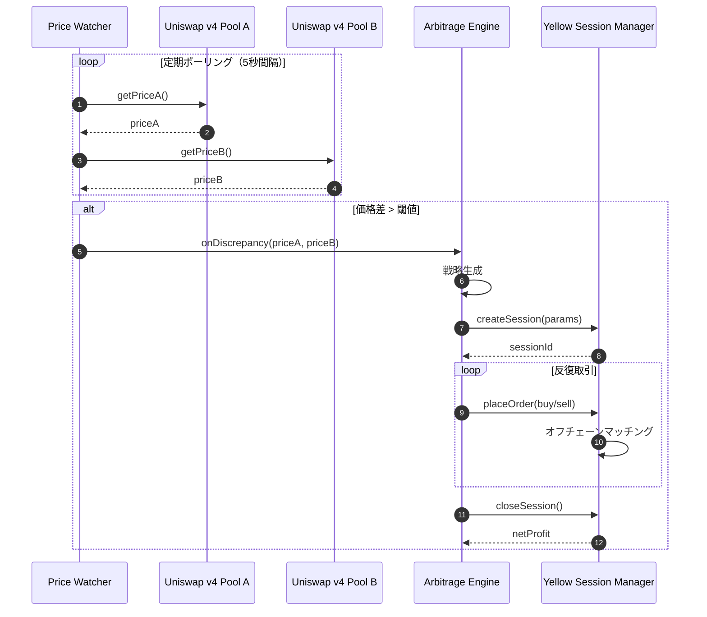

# Design Document: Offchain Arbitrage Engine

## Overview

**Purpose**: Offchain Arbitrage Engine は、複数L2のCPT価格を監視し、裁定機会を検知して、Yellow SDK によるガスレス高速裁定を実行します。

**Users**:
- **システム（自動実行）**: 価格監視・裁定戦略生成・Yellow セッション実行
- **開発者**: Yellow SDK 統合またはモック実装の選択

**Impact**:
ガスレスかつ高速な裁定実行により、L2間の価格差を効率的に取引し、Operator Vault への収益を最大化します。

### Goals

- Price Watcher による5秒間隔の価格監視
- Arbitrage Engine による最適な裁定戦略生成
- Yellow Session Manager による Yellow SDK 統合（またはモックフォールバック）
- エラーハンドリング・ログ記録の実装

### Non-Goals

- Uniswap v4 Pool 実装（uniswap-v4-integration 仕様）
- Arc + Circle 決済統合（settlement-layer 仕様）
- Dashboard UI（dashboard-demo 仕様）

---

## Architecture



---

## Components

### Price Watcher

**Service Interface**:

```typescript
interface PriceWatcherService {
  /**
   * 価格監視を開始する
   */
  start(): void;

  /**
   * 価格監視を停止する
   */
  stop(): void;

  /**
   * 価格差イベントを発行する
   */
  onDiscrepancy(callback: (discrepancy: PriceDiscrepancy) => void): void;
}

type PriceDiscrepancy = {
  priceA: bigint;
  priceB: bigint;
  spread: number; // %
  timestamp: number;
};
```

**Implementation Notes**:
- viem publicClient で Uniswap v4 Pool の価格取得
- 5秒間隔のポーリングロジック
- エラー時のリトライロジック（3回）

---

### Arbitrage Engine

**Service Interface**:

```typescript
interface ArbitrageEngineService {
  /**
   * 裁定機会を分析し、実行判断を行う
   * @returns 実行すべきYellowセッションパラメータ、またはnull（実行しない）
   */
  analyzeDiscrepancy(discrepancy: PriceDiscrepancy): Promise<YellowSessionParams | null>;

  /**
   * 裁定戦略をログに記録する
   */
  logStrategy(strategy: ArbitrageStrategy): void;
}

type YellowSessionParams = {
  direction: 'A_TO_B' | 'B_TO_A';
  amount: bigint;
  minProfit: bigint;
};
```

**Implementation Notes**:
- 価格差分析ロジック（流動性・ガス推定）
- リスク管理ルール（最大取引額等）

---

### Yellow Session Manager

**Service Interface**:

```typescript
interface YellowSessionManagerService {
  /**
   * Yellow セッションを開始する
   * @returns セッションID
   */
  createSession(params: YellowSessionParams): Promise<string>;

  /**
   * セッション内で売買指示を送信する
   */
  placeOrder(sessionId: string, order: Order): Promise<void>;

  /**
   * セッションを終了し、最終ネット結果を返す
   * @returns 最終利益（USDC単位）
   */
  closeSession(sessionId: string): Promise<bigint>;

  /**
   * モード判定（Yellow SDK or モック）
   */
  isUsingMock(): boolean;
}

type Order = {
  type: 'BUY' | 'SELL';
  token: 'CPT_A' | 'CPT_B';
  amount: bigint;
};
```

**モックフォールバック実装**:

```typescript
class MockYellowSessionManager implements YellowSessionManagerService {
  private sessions: Map<string, MockSession> = new Map();

  async createSession(params: YellowSessionParams): Promise<string> {
    const sessionId = `mock-${Date.now()}`;
    this.sessions.set(sessionId, {
      id: sessionId,
      orders: [],
      netProfit: 0n,
      status: 'ACTIVE',
    });
    console.log(`[MOCK] Yellow session created: ${sessionId}`);
    return sessionId;
  }

  async placeOrder(sessionId: string, order: Order): Promise<void> {
    const session = this.sessions.get(sessionId);
    if (!session) throw new Error('Session not found');
    session.orders.push(order);
    console.log(`[MOCK] Order placed: ${order.type} ${order.amount} ${order.token}`);
  }

  async closeSession(sessionId: string): Promise<bigint> {
    const session = this.sessions.get(sessionId);
    if (!session) throw new Error('Session not found');

    // シミュレートされた利益計算（デモ用）
    const simulatedProfit = BigInt(Math.floor(Math.random() * 100)) * 10n ** 6n; // 0-100 USDC
    session.netProfit = simulatedProfit;
    session.status = 'CLOSED';

    console.log(`[MOCK] Session closed with profit: ${simulatedProfit} USDC`);
    return simulatedProfit;
  }

  isUsingMock(): boolean {
    return true;
  }
}
```

**モード切り替え**: 環境変数 `USE_YELLOW_MOCK=true` で制御

**Implementation Notes**:
- Yellow SDK (Nitrolite) を使用、反復的に売買を実行
- Fallback: `USE_YELLOW_MOCK=true` でモック実装に切り替え
- セッション実行中のエラーはクローズしてログ記録

---

## Testing Strategy

### Unit Tests

1. **Price Watcher**: 価格取得、乖離検知
2. **Arbitrage Engine**: 戦略生成ロジック
3. **Yellow Session Manager**: セッション管理（モック含む）

### Integration Tests

1. **Price Watcher + Arbitrage Engine**: 価格差検知 → 戦略生成
2. **Arbitrage Engine + Yellow Session Manager**: セッション開始 → 実行
3. **モック実装での統合テスト**（Yellow SDK 未統合の場合）

---

## Error Handling

**Offchain Errors**:
- `RPCTimeout`: RPC タイムアウト → 3回リトライ、失敗時はエラーログ
- `YellowSessionFailed`: Yellow セッション失敗 → セッションクローズ、エラーログ

---

## Dependencies on Other Specifications

- **uniswap-v4-integration**: Uniswap v4 Pool 価格を取得
- **settlement-layer**: Yellow セッション終了後、決済処理に渡す
- **dashboard-demo**: セッションログを表示

---

## Success Criteria

本仕様が完了とみなされる条件：

1. Price Watcher が価格差を検知し、Arbitrage Engine に通知する
2. Arbitrage Engine が裁定戦略を生成し、Yellow Session Manager に指示する
3. Yellow Session Manager が Yellow SDK またはモック実装でセッションを実行する
4. すべてのテストがパスする（単体テスト・統合テスト）
5. エラーハンドリング・ログ記録が適切に実装される
