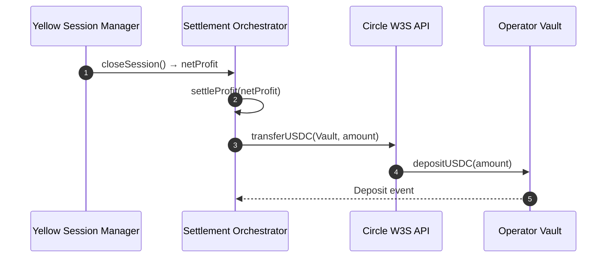

# Design Document: Settlement Layer

## Overview

**Purpose**: Settlement Layer は、Yellow セッション終了後の裁定収益をUSDCで確定し、Operator Vaultに入金する決済処理を実装します。

**Users**:
- **システム（自動実行）**: Yellow セッション終了後、決済処理を開始
- **L2運営者**: Operator Vault から収益を引き出す

**Impact**:
裁定収益を確実にOperator Vaultに入金し、L2運営者が固定費を支払える資金を提供します。

### Goals

- Settlement Orchestrator による USDC 決済処理
- Circle Programmable Wallets API (W3S) の統合
- 既存スクリプト（arc-transfer.ts, settle-to-vault.ts）の活用
- エラーハンドリング・リトライロジックの実装

### Non-Goals

- Yellow Session Manager 実装（offchain-arbitrage-engine 仕様）
- Dashboard UI（dashboard-demo 仕様）

---

## Architecture



---

## Components

### Settlement Orchestrator

**Service Interface**:

```typescript
interface SettlementOrchestratorService {
  /**
   * 裁定利益を USDC で決済し、Vault に入金する
   * @param netProfit 最終利益（USDC単位）
   * @returns 決済トランザクションハッシュ
   */
  settleProfit(netProfit: bigint): Promise<SettlementResult>;

  /**
   * Operator Vault の残高を取得する
   */
  getVaultBalance(): Promise<bigint>;
}

// 既存実装 (scripts/settle-to-vault.ts) から抽出
interface SettlementResult {
  success: boolean;
  transactionId?: string;
  txHash?: string;
  amount?: string;
  error?: string;
}
```

**Implementation Notes**:
- Circle Programmable Wallets API (W3S) を使用（既存実装活用）
- 決済失敗時は3回リトライ、失敗時はエラーログ
- Reference: `scripts/arc-transfer.ts`, `scripts/settle-to-vault.ts`

---

### 既存実装の参照

**活用するファイル**:

| ファイル | 役割 | 活用方法 |
|---------|------|---------|
| `scripts/arc-transfer.ts` | Circle W3S API によるUSDC転送 | `ArcTransferService` クラスを参考に実装 |
| `scripts/settle-to-vault.ts` | Operator Vaultへの決済 | `VaultSettlementService` クラスを参考に実装 |

**必要な環境変数**:

```bash
ARC_API_KEY=              # Circle W3S API キー
ARC_WALLET_ID_SOURCE=     # 裁定利益の送金元ウォレットID
ARC_WALLET_ID_OPERATOR_VAULT= # Operator Vault のウォレットID
ENTITY_SECRET_HEX=        # エンティティシークレット（hex形式）
```

**実装パターン（既存コードベース）**:

```typescript
// scripts/settle-to-vault.ts の VaultSettlementService を参考に
class SettlementOrchestrator implements SettlementOrchestratorService {
  private apiKey: string;
  private sourceWalletId: string;
  private vaultWalletId: string;
  private entitySecretHex: string;

  constructor() {
    this.apiKey = process.env.ARC_API_KEY || '';
    this.sourceWalletId = process.env.ARC_WALLET_ID_SOURCE || '';
    this.vaultWalletId = process.env.ARC_WALLET_ID_OPERATOR_VAULT || '';
    this.entitySecretHex = process.env.ENTITY_SECRET_HEX || '';
  }

  async settleProfit(netProfit: bigint): Promise<SettlementResult> {
    // 1. Public Key取得
    // 2. Entity Secret暗号化
    // 3. Circle W3S API で transfer 実行
    // 4. トランザクション確認
    // 詳細は scripts/settle-to-vault.ts を参照
  }
}
```

---

## Testing Strategy

### Unit Tests

1. **Settlement Orchestrator**: 決済処理
   - Circle W3S API 呼び出し
   - リトライロジック
   - エラーハンドリング

### Integration Tests

1. **Yellow Session → Settlement → Vault**: Yellow セッション終了 → USDC 決済 → Vault 入金確認

---

## Dependencies on Other Specifications

- **core-token-system**: Operator Vault が完成している必要がある
- **offchain-arbitrage-engine**: Yellow Session Manager から最終利益を受け取る
- **dashboard-demo**: Vault 残高を表示

---

## Success Criteria

本仕様が完了とみなされる条件：

1. Settlement Orchestrator が Yellow セッション終了後、USDC を Operator Vault に入金する
2. Circle Programmable Wallets API (W3S) が正常に動作する
3. 既存スクリプトのパターンが適切に活用される
4. すべてのテストがパスする（単体テスト・統合テスト）
5. エラーハンドリング・ログ記録が適切に実装される
